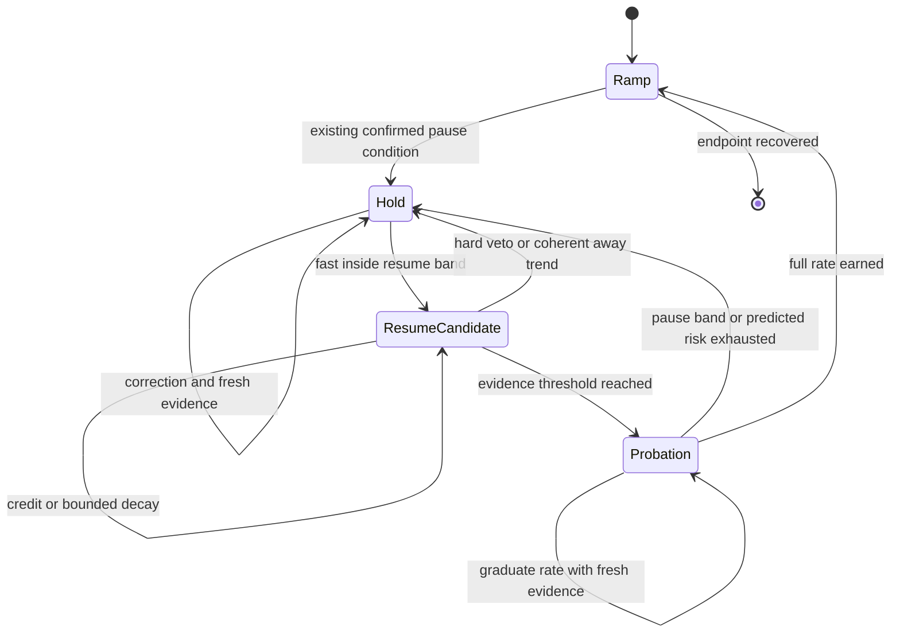

# Mini DMA iso-stress current-sweep speed design

Status: analysis and design only. No controller behavior is changed by this document.

Date: 2026-07-21

## Scope and provenance

This design addresses the wall-clock cost of Mini DMA iso-stress current sweeps while preserving stress control. Its primary evidence is the finalized Prague run:

`G:\My Drive\1 Projects\Praha\mini DMA\Ni48Fe25Ga23Co4 1_7 iso-stress`

The run recorded commit `ee10c238c1aa2bed66110277facb3bfe1ef0f1b4`, control logic `2026-07-20.3`, a 1.8 s hold-processing window, and a requested current rate of 0.4 mA/s. The design branch was created independently from stable `origin/main` at `dd8bc5042445f3bf80f11f6750b06ec007845234`.

This work is deliberately separate from PR 298 and the Tic USB/target-acceptance reliability work. It does not propose hardware transport, Tic lifecycle, motor-completion, or process-isolation changes. Because the evidence run used an unmerged PR-branch commit, validation must replay the exact recorded logic as the baseline rather than silently treating current `main` as identical.

## Finding

The run was scientifically useful but much slower than its current recipe required. The main opportunity is not a faster nominal current rate. It is avoiding long, repeated holds after the stress signal has already shown credible recovery.

| Quantity | Observed |
|---|---:|
| Recorded duration | 21,514.7 s (5.98 h) |
| Current hold | 19,022.0 s (5.28 h, 88.4%) |
| Current ramp | 2,151.9 s (35.9 min) |
| Other phases | 340.8 s (5.7 min) |
| Slowdown versus the same endpoint without holds | 8.63x |
| Completed loops | 14 |
| Hold windows | 656 (638 recovered) |
| Median hold / first recovery | 16.0 s / 3.25 s |
| Median time after first recovery | 11.25 s |
| Windowized hold time after first recovery | 15,225.3 s |
| Holds longer than 30 s | 197, consuming 71.0% of windowized hold time |
| Median / p95 filtered noise | 0.883 / 4.810 MPa |
| Raw scale cadence | 202.6 ms median; 405.2 ms p95; 841.7 ms maximum gap |

The largest hold concentrations were at 30-49 mA: the 30, 35, 40, and 45 mA bins together account for about 14,046 s, or 74% of all hold time. These bins also have substantial strain spans, so the evidence does not support classifying every long hold as measurement noise. Real transformation and ordinary fluctuation overlap there.

The trace nevertheless shows a confirmation bottleneck. The dominant wait reasons were `hold_error_not_persistent` (20,797 rows), `filtered_signal_unchanged` (9,025), `2_fresh_scale_samples` (7,195), and `new_scale_sample` (6,136). The windowized data reached its first recovery criterion in 3,236 s total but then spent 15,225 s before final release. This is consistent with repeated evidence resets, not simply slow motor travel or an always-far-from-target mean.

Motor motion was not the sole source of the fluctuations. Median absolute stress change was 2.31 MPa while the recorded position was stationary and 3.11 MPa while it moved. This attribution is observational, not causal, but it rules out a design based only on reducing motor motion.

## Why a longer processing window is not the direct fix

The earlier audit applied trailing medians from 0.5 to 10 s to the recorded 2 Hz measurement log. Longer windows often found an earlier apparent resume and the 8-10 s windows had a lower three-second rebound proxy. That is useful sensitivity evidence, but not a closed-loop result:

- an earlier resume changes current, motor commands, transformation, and every later sample;
- a long trailing median can cross the target late and appear stable after the physical signal has already changed;
- volatility can be real transformation, so “more noise means a longer control window” can hide the event that requires fast action;
- the recorded raw scale is irregular and faster than the 2 Hz measurement log, so a seconds-only window does not guarantee a fixed evidence count.

Therefore the direct motor-control estimate should remain fast. A slower or adaptive window should judge confidence, not replace the value used to control stress.

## Existing behavior to preserve

The current controller already has safeguards that should remain authoritative:

- a 1.8 s robust center with outlier rejection, slope estimation, and endpoint projection;
- distinct pause and resume bands with minimum stress floors and bounded noise contribution;
- confirmed hold entry, persistent-error gating, fresh-sample gating, reversal handling, and response-stiffness learning;
- conservative correction caps and volatile-response containment;
- hard stress, load, wire-break, voltage, motion, and freshness safety paths;
- a post-hold throttle on upward sweeps (currently 6 s at 0.6 of the recipe rate on `main`).

The first implementation slice should not change the motor seek/correction law, hold-entry bands, hard safety decisions, recipe rate, or operator-visible tuning surface.

## Recommended policy

### 1. Dual-timescale evidence

Keep the existing 1.8 s robust signal as the fast control channel. Add a separate slow confidence channel computed only from fresh raw scale samples.

The slow horizon should target an effective inlier count, not grow merely because variance is high:

- minimum horizon: 3 s;
- maximum horizon: 8 s;
- target: at least 12-20 robust inlier samples, adjusted for actual cadence;
- shrink toward the minimum when a change point or coherent slope indicates transformation;
- expand only while the fast and slow slopes agree that the signal is approximately stationary;
- never use the slow center for hard safety, hold entry, or direct motor correction.

The slow channel should expose center, robust noise, slope, target-band occupancy, sample count, largest gap, and a change-point flag. This makes “confidence” inspectable instead of hiding it in a dynamically changing average.

### 2. Evidence-based resume confirmation

Replace the brittle uninterrupted in-band timer with a bounded evidence accumulator, updated once per new scale sample rather than once per 250 ms controller tick.

Starting replay candidate:

- earn credit while the fast error is inside the active resume band, the slow slope is not credibly moving away, samples are fresh, and no hard veto is active;
- retain or gently decay credit for an isolated sample in the grey region between resume and pause bands when slow confidence still indicates a centered, stationary process;
- reset credit immediately for stale feedback, a hard/safety excursion, fast error beyond the pause band, a coherent away trend, a sign-reversing transformation, or transport uncertainty;
- cap stored credit so old good samples cannot authorize a much later resume;
- test required evidence of 0.5, 0.75, and 1.0 equivalent seconds and decay ratios of 0.5x, 1x, and 2x offline.

This preserves confirmation while preventing one noisy sample from erasing several independent signs of recovery. The trace must record credit, reason for credit/decay/reset, fast and slow estimates, and the exact resume veto.

### 3. Reduced-rate resume probation

Generalize the existing fixed upward-only post-hold throttle into an explicit probation state on both current directions. Probation is not permission to tolerate worse stress; it is a reversible trial that gathers causal evidence at low current slew.

Starting replay grid:

- initial rate multiplier: 0.25, 0.4, or the current 0.6;
- graduate through at most three levels to 1.0 as evidence remains good;
- minimum graduation evidence: three fresh samples and 1.5 s;
- maximum probation: 6, 10, or 15 s;
- return immediately to hold if the fast error crosses the pause band or predicted one-sided risk exhausts the available headroom;
- never exceed the recipe rate and never “catch up” by jumping the current schedule after probation.

The down-sweep must be included because the finalized recipe reverses current and transformation can occur on both legs. Direction-specific behavior may be retained only if replay demonstrates a real asymmetry.

### 4. Noise- and trend-aware current slew

Apply a multiplier in `[0, 1]` to the requested recipe rate. It may slow current but must never accelerate beyond the recipe. Use one-sided predicted risk rather than noise magnitude alone:

`risk = |fast error| + horizon * away_slope + uncertainty_margin`

where `away_slope` is zero unless the slope moves stress away from target, and `uncertainty_margin` is derived from robust noise, scale readability, sample count, cadence gaps, and fast/slow disagreement. Map the remaining margin to the pause band onto discrete rate levels (for example 0, 0.25, 0.5, 0.75, 1.0) with hysteresis.

Important constraints:

- high symmetric noise while centered should not automatically stop the ramp;
- coherent transformation drift must reduce the rate sooner than stationary noise of the same amplitude;
- missing or stale evidence chooses the conservative level;
- the initial slice should use observed stress slope, not learned current-to-stress feed-forward;
- any later learned `d(stress)/d(current)` term must use motor-stationary, direction-consistent segments and carry uncertainty because transformation response is nonstationary.

This layer should be evaluated after resume evidence and probation, both alone and combined. Otherwise reduced hold time cannot be attributed to the correct mechanism.

## Proposed state machine

Hard safety checks run in every state and bypass this policy.

## Offline replay and validation plan

### Phase 0: freeze provenance

Create a read-only run manifest containing hashes and row counts for `metadata.json`, `measurement.csv`, `scale_raw.csv`, `control_trace.csv`, and `run_quality.json`. Record the exact controller fingerprint and commit. Keep the primary run outside tests; tests use synthetic or disposable excerpts.

Reproduce the baseline from `2026-07-20.3` as a pure, dependency-light state machine. Do not import Qt, serial, PSU, Tic, or hardware modules. Current `trace_replay.py` is useful for trace-compatible output but only reclassifies recorded decisions; it is not a causal closed-loop replay. The existing `wire_simulator.py` provides deterministic scenario conventions but also needs a current-sweep/hold/probation plant loop for this question.

### Phase 1: same-timeline shadow replay

Replay `scale_raw.csv` at its recorded irregular timestamps and join current, motor position, target, and phase from the other logs. Emit, for every fresh sample:

- baseline state and reconstructed baseline decision;
- fast and slow signal summaries;
- resume evidence credit and veto reason;
- probation state and candidate rate multiplier;
- predicted risk/headroom;
- counterfactual hold/resume/rate decision.

This phase must exactly reproduce baseline hold entry/exit events within a documented timestamp tolerance before candidate comparisons are trusted. It can measure decision disagreement and early-resume opportunities, but it cannot claim a new wall time after trajectories diverge.

### Phase 2: deterministic closed-loop replay

Build a hybrid plant model with current, motor position, stress, strain, direction, target, and delayed scale observations. Identify local current and motor response only from eligible segments, preserve direction and target, and bootstrap contiguous residual blocks so transformation/noise correlation and cadence gaps survive.

Run at least these model families:

1. fitted Prague model from the finalized run, with leave-one-loop-out evaluation;
2. conservative response bounds using slower/faster stress and motor response than fitted;
3. synthetic stationary noise, coherent transformation, sign reversal, delayed feedback, sparse feedback, outliers, and drift scenarios;
4. a calm real-run hold-out and a different sample/composition, selected only after quality screening.

The related `1_2`, `1_3`, and `1_8` folders are useful failure/adversarial inputs, but their recorded quality ends in `wire_break_or_contact_loss`; they must not be presented as clean acceptance baselines.

Use deterministic seeds and write `measurement.csv`, `control_trace.csv`, `summary.json`, and scenario metadata for every run.

### Phase 3: ablation matrix

Compare:

1. exact recorded baseline;
2. dual-timescale diagnostics only;
3. evidence accumulator only;
4. probation only;
5. noise/trend rate limiter only;
6. evidence plus probation;
7. the full candidate.

Sweep the small parameter grids above. Select one Pareto candidate before any controller integration; do not add user-facing knobs to expose the grid.

### Metrics

Speed:

- wall time to the same current endpoints and completed loops;
- hold time/fraction, hold count, and hold-duration quantiles;
- effective current throughput and probation time;
- avoidable time after first credible recovery.

Stress control and safety:

- median, p95, p99, and maximum absolute target error;
- time outside resume, pause, and hard-safety bands;
- one-sided overshoot/undershoot and worst 1, 3, and 10 s post-resume error;
- re-hold rate within 1, 3, and 10 s;
- stale-feedback and raw-sample safety responses.

Scientific fidelity:

- transformation onset/offset current;
- peak strain, strain span, and current-strain loop area by direction and target;
- completed loop count and endpoint coverage.

Actuation:

- motor moves, blocked moves, travel, reversals, maximum command, and moves/min;
- current setpoint changes, rate-level transitions, and stop/start chatter.

### Acceptance gates before implementation is recommended

A candidate must pass all gates across fitted, hold-out, and adversarial scenarios:

- no new hard-safety, wire-break, stale-feedback, voltage, or transport bypass;
- recipe current rate is never exceeded;
- no worse p95 absolute stress error than baseline by more than 5%, and no worse maximum one-sided error beyond a readability/noise-derived margin;
- no increase in time outside the existing pause band;
- no material shift in transformation onset, peak strain, or loop area (pre-register a 1% relative comparison where the baseline value is well-conditioned, otherwise use a measurement-resolution bound);
- post-resume re-hold rate and motor travel do not increase by more than 5%;
- at least 20% reduction in total simulated wall time and 25% reduction in hold time on the primary Prague model, with no regression on the calm hold-out;
- the improvement remains positive under conservative plant bounds and multiple residual seeds.

The speed threshold is intentionally material: a small gain does not justify a more complex controller.

## Closed-loop simulation results (2026-07-22)

A dependency-light simulator now closes the loop among current, transformation strain, motor correction, correlated scale noise, irregular feedback cadence, and the four policy shapes. It contains no Qt, serial, PSU, scale, or Tic imports and performs no hardware I/O. The comparison used five scenarios, four policies, and 12 paired deterministic seeds (240 runs total).

The policies were:

1. `baseline`: current hold/resume policy shape;
2. `evidence`: dual-timescale diagnostics plus bounded resume evidence;
3. `evidence_probation`: evidence plus explicit bidirectional reduced-rate probation;
4. `proposed`: evidence, probation, and the one-sided noise/trend current-rate limiter.

All 240 runs completed without a simulated stress-safety stop, and no policy exceeded the requested 0.4 mA/s recipe rate. Median changes versus each scenario's baseline were:

| Scenario | Policy | Elapsed | Hold | p95 true stress error |
|---|---|---:|---:|---:|
| Prague-like volatile | Evidence | -23.28% | -22.26% | +2.53% |
| Prague-like volatile | Evidence + probation | -7.47% | -5.86% | -1.00% |
| Prague-like volatile | Full proposed | +2.24% | +3.39% | -3.54% |
| Calm | Evidence | -1.66% | +19.44% | +6.84% |
| Coherent transformation | Evidence | -3.18% | +11.06% | +9.56% |
| Sparse feedback | Evidence | -24.82% | -23.99% | +14.20% |
| Heavy-tail noise | Evidence | -21.51% | -19.56% | +2.30% |

Evidence-only is the sole materially faster Prague-like candidate, but it misses the 25% hold-time target and exceeds the +5% p95 stress-error gate in the calm, coherent-transformation, and sparse-feedback hold-outs. Evidence plus probation removes most of the speed benefit. The full stack generally improves stress error, but it is slower in four of five scenarios.

A separate screen tested 18 stricter coherent-motion evidence combinations. None passed both the cross-scenario p95 error gate and the no-increase-in-time-outside-pause gate. Extra fixed confirmation during coherent motion is therefore rejected as a remedy.

The Prague-like simulator baseline has p95 measured absolute stress error of about 21.6 MPa, close to the audited run's roughly 20.3 MPa, but only about 69.7% simulated hold fraction versus 88.4% recorded. It therefore understates the real hold bottleneck and is a policy-shape model, not a calibrated digital twin.

**Decision:** no simulated candidate is ready for controller implementation. The next iteration should first prove event-level parity with the recorded baseline, fit loop-local plant/residual models, and redesign evidence so stationary noise can be distinguished from coherent transformation without adding a fixed confirmation burden.

## Fixed-current hunting analysis and cycle-center simulation (2026-07-22)

The finalized Prague trace changes the diagnosis. Among the 656 windowized hold segments, the 197 segments lasting at least 30 s consumed 71.0% of hold time. Within those long segments, 86.6% of time had no more than 0.02 mA current span, 76.3% had an endpoint stress shift smaller than one quarter of the within-segment stress span, and 96.9% had a segment-center error no larger than 5 MPa. The typical signal was therefore not a monotonic recovery toward target: it repeatedly traversed a roughly centered oscillation while current was effectively fixed. The estimated stress period was about 10.3 s at the median and 16.6 s at the upper quartile.

That finding makes a longer processed value useful, but not as a replacement for fast safety feedback. The underlying loop problem is that the 1.8 s median sees one oscillation phase, commands a motor correction, and then resets the post-move evidence needed to resume current. A longer center should first decide whether a motor correction is justified. Raw/latest and 1.8 s feedback must still retain authority for hold entry, hard stress limits, stale-data detection, and a veto on resuming current.

The simulator was extended with a dedicated `prague_stationary_hunting` case containing the audited 10.3 s oscillation, delayed mechanical response, and a post-move feedback-settle gate. Its baseline is a mechanistic calibration rather than a replay: median hold fraction is 92.7% versus 88.4% recorded, and 62.8% of hold time is in episodes of at least 30 s versus 71.0% recorded. The baseline p95 hold duration is 71.5 s and maximum continuous hold is 211.8 s, so it reproduces the long fixed-current failure regime without claiming sample-identical trajectories.

Three ablations were compared against the current-policy baseline over 12 paired deterministic seeds:

| Candidate | Elapsed change | Hold change | p95 true-error change | Interpretation |
|---|---:|---:|---:|---|
| Cycle-center motor | -51.74% | -55.87% | -4.59% | Stops phase-chasing motor moves when the long center is near target. |
| Cycle-center resume | 0.00% | 0.00% | -0.00% | Cannot help while continued motor moves keep invalidating post-move confirmation. |
| Combined motor + resume probation | -31.49% | -34.58% | -2.08% | Helps, but extra resume/probation logic gives back substantial speed. |

The motor-only candidate reduced median elapsed time from 3,796.8 s to 1,832.4 s and hold time from 3,519.0 s to 1,553.0 s. It reduced p95 hold duration from 71.5 s to 24.8 s, the share of hold time in 30 s or longer episodes from 62.8% to 6.8%, time outside the pause band from 2,898.5 s to 1,151.4 s, motor travel from 5.861 mm to 2.594 mm, and motor reversals from 707.5 to 331.0. All 12 paired runs completed with no safety stop and no rate above the requested 0.4 mA/s. Every seed was faster: elapsed improvement ranged from 43.1% to 61.7%, while the worst seed-level p95 stress-error change was +0.22%, inside the pre-registered +5% gate. Re-holds improved at the median and the worst seed increased by 1.39%, also inside the +5% gate.

The same candidate was exactly inactive in all 12 seeds of the original Prague-volatile, calm, coherent-transformation, sparse-feedback, and heavy-tail scenarios because those holds did not accumulate the required fixed-current history. This is a useful non-regression property, not proof that those five simple plants cover all slow real-wire behavior.

A 36-configuration screen varied the long-window maximum, minimum fixed-current span, center band, and stationary-drift allowance. Twenty-four configurations passed the model gates. The 10-12 s windows often produced little benefit or made elapsed time worse because they still represented only part of the measured oscillation. The selected conservative configuration uses at most 20 s of data, requires at least 10 s and 32 samples at effectively unchanged current, a +/-5 MPa center band, and endpoint drift no larger than 15% of the observed oscillation span. These are offline screen values, not production defaults.

**Revised decision:** the best first controller candidate is cycle-aware motor suppression, not permissive resume logic. When the fixed-current long center is near target and the signal is stationary, do not chase the fast-window phase with another motor move. If the long center is biased, use it only to choose a conservative correction direction/magnitude; keep the current held. After motor activity stops, let the existing fresh-feedback resume path release the hold. The cycle-center resume and reduced-rate probe remain later ablations because they did not add net value here.

## Implementation sequence after design approval

1. Extract a pure hold/resume supervisor and baseline parity tests.
2. Add slow confidence diagnostics in shadow mode only.
3. Add evidence accumulation behind a non-UI feature flag and replay it.
4. Add explicit probation by generalizing the existing post-hold throttle.
5. Add the one-sided rate limiter only if its ablation contributes net speed or safety.
6. Preserve all existing hard gates and motor-correction behavior; update the control-logic fingerprint and trace schema.
7. Only after offline acceptance, prepare a separately authorized campaign and simulator-backed live ladder. This document does not authorize hardware testing.

## Recommendation

Proceed to an offline baseline-parity and shadow-replay implementation of the fixed-current cycle-center estimator; do not change the live controller yet. Replay must show when the estimator becomes ready, which real motor commands it would suppress, whether the existing post-move feedback gate would then release the hold, and every fast/raw veto. Only after event-level parity and held-out real-run validation should cycle-aware motor suppression be implemented behind a non-UI feature flag. Do not include cycle-center resume or new probation logic in that first slice: the ablation shows that solving phase-chasing at the motor-decision layer is both simpler and faster.

## Experimental controller implementation (2026-07-23)

The first live-controller slice is implemented on the isolated design branch and is enabled by default for hardware validation. Set the non-UI environment flag `MINI_DMA_CYCLE_CENTER_MOTOR_SUPPRESSION=0` to restore baseline behavior. It does not alter hold entry, current resume, recipe rate, hard stress limits, stale-feedback handling, fresh-sample confirmation, persistence, reversal, or post-move settling. After those gates permit another correction, the controller can suppress that motor command when all of the following are true:

- current is already held and at least 10 s / 32 scale samples were collected since hold entry;
- the fixed-current robust center from at most 20 s of data is within 5 MPa of target;
- the two half-window centers indicate no material drift, bounded by 0.35 MPa/s and 15% of the observed signal span;
- neither the latest raw-equivalent stress nor the 1.8 s processed value is more than 35 MPa from target.

If any condition fails, the existing correction path runs unchanged. The feature state and all cycle-center evidence are included in the control-logic fingerprint and `control_trace.csv`. This is an experimental branch implementation, not a `main` default.

## Run 15 hardware result and revised controller direction (2026-07-28)

The guarded 50 MPa run on `Ni47Fe24Ga23Co6 2/1` tested control logic
`2026-07-28.2`. That revision fixed a concrete lifecycle bug: cycle-center
resume eligibility was evaluated while the published phase was still
`current`, immediately before the controller published `current_hold`.
Eligibility now also recognizes the active held-current step. The fix produced
17 genuine cycle-center resumes in run 15, versus none in run 14.

The narrow fix did not solve the physical-control problem. Run 15 was stopped
deliberately at 39 mA after the hold had become unproductive. Independent
supervisor cleanup confirmed HMP channels 3 and 4 off at 0 V / 0 mA; the Tic
was Reset and de-energized.

| Quantity | Run 15 | Run 14 | Completed run 06 |
|---|---:|---:|---:|
| Control logic | 2026-07-28.2 | 2026-07-28.1 | 2026-07-23.3 |
| Elapsed | 1,892.8 s | 1,605.4 s | 2,194.4 s |
| Maximum set current | 39.0 mA | 36.0 mA | 40.0 mA |
| Completed current loops | 0 | 0 | 1 |
| Current-hold fraction | 92.13% | 91.28% | 89.45% |
| Stress-error RMS | 17.61 MPa | 8.73 MPa | 9.71 MPa |
| Hold-only RMS | 18.31 MPa | 9.10 MPa | 10.23 MPa |
| p95 absolute stress error | 40.63 MPa | 19.20 MPa | 18.73 MPa |
| Maximum stress | 148.31 MPa | 139.95 MPa | 122.30 MPa |
| Motor commands | 795 | 607 | 1,340 |
| Mean / maximum command | 3.87 / 33.75 um | 2.93 / 58.75 um | 3.25 / 28.75 um |
| Longest released hold | 110.32 s | 192.50 s | 145.26 s |

Run 15 therefore proves that cycle-center resume can release a centered,
oscillatory hold, but also shows why it is insufficient. The fast recovery
controller continued issuing corrections while the statistical center was
being established. Each move changed the plant state and restarted response
qualification. At 39 mA the processed stress traversed a wide range while the
motor repeatedly reversed; a final 23.75 um tension correction after a
near-zero stress observation made further running scientifically unhelpful.

### Rejected no-move observation trigger

An offline `processed_observation` policy was added to the dependency-light
simulator. It enters a no-move observation period only after a fixed-current
signal spans the target, has a centered low-trend robust distribution, adequate
cadence, non-trivial noise, and repeated motor reversals. Across 20 paired
seeds, it reduced stationary-hunting median elapsed time from 3,882.25 s to
1,684.75 s (-56.6%), hold time from 3,608.25 s to 1,408.25 s (-61.0%), and
motor travel from 6.01 mm to 2.32 mm while improving p95 true stress error by
2.4%. It was exactly neutral in the simulator's calm, coherent-transformation,
sparse-feedback, volatile, and heavy-tail scenarios.

That synthetic non-regression is not sufficient. A same-timeline trigger
classifier found 41 candidate observation windows in run 15 but 1,160 in the
finalized transforming Prague trace. The real transforming trace therefore
contains the same centered, noisy, motor-reversing signature. Because
same-timeline classification cannot show what the counterfactual trajectory
would become, and because the trigger does not distinguish real transformation
well enough, this candidate is rejected for another hardware run.

### Underlying control problem

The controller currently combines three jobs in one fast heuristic loop:

1. estimate the stress state from correlated and sometimes oscillatory scale
   measurements;
2. decide whether an observed change is noise, delayed motor response,
   thermal drift, or transformation;
3. choose a motor correction.

The fast processed error is suitable for safety and hold entry, but not for
repeated actuation when the response delay is comparable to the oscillation
period. In that regime the controller reacts to phase rather than to the
underlying center. Resume exceptions can shorten individual holds, but they
cannot make the motor loop well damped.

### Recommended estimator-based controller

The next controller should be designed as a small state estimator plus a
rate-limited actuator, not as another resume condition:

- **Safety channel:** latest/raw-equivalent and fast 1.8 s processed values
  retain authority for hard stress, wire-break, stale-feedback, voltage, and
  pause decisions.
- **Control channel:** estimate robust mean stress, mean-stress drift, and
  uncertainty on a slower clock using fresh samples and their actual cadence.
  Correlated samples must reduce effective sample count; a large raw spread
  must not itself create a control error.
- **Response model:** after one motor command, wait for the identified
  move/settle/dead-time interval and estimate the signed change in mean stress.
  Only one unassessed response may exist at a time.
- **Disturbance state:** represent thermal/transformation drift separately from
  motor response. Persistent one-sided drift earns bounded following motion;
  zero-mean oscillation increases uncertainty but does not request alternating
  motor moves.
- **Actuator:** use a conservative PI or one-step predictive correction on the
  estimated mean, with deadband, anti-windup, command/travel limits, and an
  explicit reversal penalty. The integral term is frozen while response is
  unobserved or uncertainty is too high.
- **Current supervisor:** continue or resume current when the estimated mean
  and projected short-horizon stress are acceptable. Preserve the existing
  reduced-rate probation and never exceed the recipe rate.

This architecture naturally protects a good transforming sample: coherent
disturbance drift remains visible and is followed, while high-frequency
oscillation around an acceptable mean is not chased.

### Offline validation required before another hardware campaign

1. Fit response delay, signed mean-stress gain, disturbance drift, and
   correlated residual blocks separately from run 15 and from multiple loops of
   the finalized Prague run.
2. Reconstruct the current controller event-by-event before comparing the new
   controller.
3. Run leave-one-loop-out closed-loop tests on the finalized Prague run and use
   run 15 only as the hunting/failure calibration.
4. Add a genuinely calm real run and a large-strain transforming run as
   external hold-outs; synthetic coherent transformation is not enough.
5. Compare baseline, estimator only, one-response budget, PI/predictive action,
   and the full controller.
6. Require no new safety stops, no recipe-rate overshoot, p95 stress error no
   worse than +5%, no increase in time outside the pause band, motor travel and
   reversals no worse than +5%, and no material shift in transformation onset,
   peak strain, or loop area.
7. Require at least 25% lower hold time on hunting cases and no material
   wall-time or scientific-fidelity regression on the real transforming
   hold-out before preparing a new approved `campaign.yaml`.

**Current decision:** retain the narrow lifecycle fix, keep the observation
policy offline, and do not run another hardware campaign until an
estimator-based candidate passes the real-run hold-outs.

The broader approach catalogue, ranking, and restart checklist are maintained
in [Mini DMA iso-stress control options](mini_dma_iso_stress_control_options.md).

## Volatile-response observer candidate (2026-07-29)

A wholesale slow-estimator actuator was rejected in closed-loop simulation. It
shortened stationary hunting but serialized ordinary calm and transforming
holds, exposing a semantic deadlock where the processed center said "do not
move" while the narrower fast resume gate said "do not resume."

The retained candidate is narrower. The existing fast/raw channels still own
hold entry, normal resume, stale feedback, wire-break detection, and stress
safety. After three distinct `volatile_response_unsettled` groups within
15 seconds at held current, the experimental controller waits 10 seconds after
the last motor response before allowing another correction. A mature
cycle-center signal then either suppresses a centered correction or supplies
the correction error. The mode is disabled after the measured session strain
span reaches 0.30%, so a large-strain transforming wire stays on the established
disturbance-following path. The feature is non-UI and opt-in through
`MINI_DMA_VOLATILE_RESPONSE_OBSERVER=1`.

Four-seed closed-loop screening of `adaptive_response_window` reduced median
stationary-hunting elapsed time by 62.8% and hold time by 68.0%, while improving
p95 true stress error by 3.3%. It was exactly inactive in the simulator's
volatile, calm, coherent-transformation, sparse-feedback, and heavy-tail
hold-outs.

The same-timeline real-trace shadow screen used response classifications rather
than waveform appearance. On run 15 it would activate in five long holds
covering approximately 625 seconds. On the finalized transforming Prague trace
it produced zero activations: the measured strain span crossed the 0.30%
transformation gate at 350.5 seconds, before any qualifying dense volatile
response burst. This is trigger and non-regression evidence, not causal replay;
live acceptance still requires a checked campaign and guarded hardware ladder.

### Guarded live validation (2026-07-29)

The checked
`20260729_Ni47_2-1_36p82mm_volatile-observer` campaign used the remounted
Ni47Fe24Ga23Co6 2/1 wire (36.82 mm mounted length, 15.1 um database diameter),
50 MPa target, 300 MPa hard guard, and the observer opt-in. Both stages
completed normally and the supervisor verified CH3/CH4 off afterward:

- the 1->10->1 mA probe completed in 245.6 s with 143.9 s in current hold,
  4.16 MPa RMS error, and 8.05 MPa p95 absolute error;
- the full 1->40->1 mA loop completed in 741.8 s with 486.5 s in current hold,
  6.00 MPa RMS error, 11.21 MPa p95 absolute error, and 31.997 MPa maximum
  absolute error;
- archived run 15 stopped without completing a loop after 1,892.8 s, including
  1,680.5 s in current hold, with 17.61 MPa RMS and 40.63 MPa p95 absolute
  error;
- archived completed run 06 took 2,194.4 s, including 1,937.7 s in current
  hold, with 9.71 MPa RMS and 18.73 MPa p95 absolute error.

The full live run contained one extreme volatile-response episode at 31.2 mA,
but not three distinct qualifying groups within 15 seconds. The observer
therefore never activated. The completed loop validates branch-level safety and
performance and demonstrates that the dormant opt-in does not perturb a
recoverable run; it does **not** causally attribute the improvement to the
observer. The conservative trigger remains unchanged to avoid fitting a policy
to one remount. Activation and good-transforming-wire behavior still require
direct live validation before the feature can be enabled by default.
