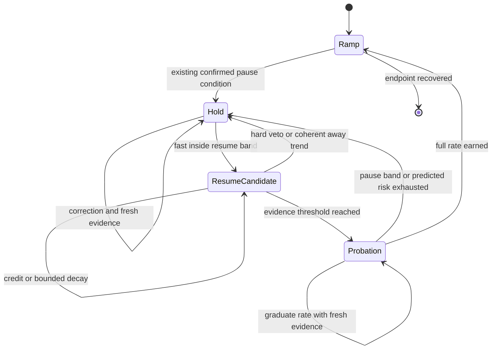

# Mini DMA iso-stress current-sweep speed design

Status: analysis and design only. No controller behavior is changed by this document.

Date: 2026-07-21

## Scope and provenance

This design addresses the wall-clock cost of Mini DMA iso-stress current sweeps while preserving stress control. Its primary evidence is the finalized Prague run:

`G:\My Drive\1 Projects\Praha\mini DMA\Ni48Fe25Ga23Co4 1_7 iso-stress`

The run recorded commit `ee10c238c1aa2bed66110277facb3bfe1ef0f1b4`, control logic `2026-07-20.3`, a 1.8 s hold-processing window, and a requested current rate of 0.4 mA/s. The design branch was created independently from stable `origin/main` at `dd8bc5042445f3bf80f11f6750b06ec007845234`.

This work is deliberately separate from PR 298 and the Tic USB/target-acceptance reliability work. It does not propose hardware transport, Tic lifecycle, motor-completion, or process-isolation changes. Because the evidence run used an unmerged PR-branch commit, validation must replay the exact recorded logic as the baseline rather than silently treating current `main` as identical.

## Finding

The run was scientifically useful but much slower than its current recipe required. The main opportunity is not a faster nominal current rate. It is avoiding long, repeated holds after the stress signal has already shown credible recovery.

| Quantity | Observed |
|---|---:|
| Recorded duration | 21,514.7 s (5.98 h) |
| Current hold | 19,022.0 s (5.28 h, 88.4%) |
| Current ramp | 2,151.9 s (35.9 min) |
| Other phases | 340.8 s (5.7 min) |
| Slowdown versus the same endpoint without holds | 8.63x |
| Completed loops | 14 |
| Hold windows | 656 (638 recovered) |
| Median hold / first recovery | 16.0 s / 3.25 s |
| Median time after first recovery | 11.25 s |
| Windowized hold time after first recovery | 15,225.3 s |
| Holds longer than 30 s | 197, consuming 71.0% of windowized hold time |
| Median / p95 filtered noise | 0.883 / 4.810 MPa |
| Raw scale cadence | 202.6 ms median; 405.2 ms p95; 841.7 ms maximum gap |

The largest hold concentrations were at 30-49 mA: the 30, 35, 40, and 45 mA bins together account for about 14,046 s, or 74% of all hold time. These bins also have substantial strain spans, so the evidence does not support classifying every long hold as measurement noise. Real transformation and ordinary fluctuation overlap there.

The trace nevertheless shows a confirmation bottleneck. The dominant wait reasons were `hold_error_not_persistent` (20,797 rows), `filtered_signal_unchanged` (9,025), `2_fresh_scale_samples` (7,195), and `new_scale_sample` (6,136). The windowized data reached its first recovery criterion in 3,236 s total but then spent 15,225 s before final release. This is consistent with repeated evidence resets, not simply slow motor travel or an always-far-from-target mean.

Motor motion was not the sole source of the fluctuations. Median absolute stress change was 2.31 MPa while the recorded position was stationary and 3.11 MPa while it moved. This attribution is observational, not causal, but it rules out a design based only on reducing motor motion.

## Why a longer processing window is not the direct fix

The earlier audit applied trailing medians from 0.5 to 10 s to the recorded 2 Hz measurement log. Longer windows often found an earlier apparent resume and the 8-10 s windows had a lower three-second rebound proxy. That is useful sensitivity evidence, but not a closed-loop result:

- an earlier resume changes current, motor commands, transformation, and every later sample;
- a long trailing median can cross the target late and appear stable after the physical signal has already changed;
- volatility can be real transformation, so “more noise means a longer control window” can hide the event that requires fast action;
- the recorded raw scale is irregular and faster than the 2 Hz measurement log, so a seconds-only window does not guarantee a fixed evidence count.

Therefore the direct motor-control estimate should remain fast. A slower or adaptive window should judge confidence, not replace the value used to control stress.

## Existing behavior to preserve

The current controller already has safeguards that should remain authoritative:

- a 1.8 s robust center with outlier rejection, slope estimation, and endpoint projection;
- distinct pause and resume bands with minimum stress floors and bounded noise contribution;
- confirmed hold entry, persistent-error gating, fresh-sample gating, reversal handling, and response-stiffness learning;
- conservative correction caps and volatile-response containment;
- hard stress, load, wire-break, voltage, motion, and freshness safety paths;
- a post-hold throttle on upward sweeps (currently 6 s at 0.6 of the recipe rate on `main`).

The first implementation slice should not change the motor seek/correction law, hold-entry bands, hard safety decisions, recipe rate, or operator-visible tuning surface.

## Recommended policy

### 1. Dual-timescale evidence

Keep the existing 1.8 s robust signal as the fast control channel. Add a separate slow confidence channel computed only from fresh raw scale samples.

The slow horizon should target an effective inlier count, not grow merely because variance is high:

- minimum horizon: 3 s;
- maximum horizon: 8 s;
- target: at least 12-20 robust inlier samples, adjusted for actual cadence;
- shrink toward the minimum when a change point or coherent slope indicates transformation;
- expand only while the fast and slow slopes agree that the signal is approximately stationary;
- never use the slow center for hard safety, hold entry, or direct motor correction.

The slow channel should expose center, robust noise, slope, target-band occupancy, sample count, largest gap, and a change-point flag. This makes “confidence” inspectable instead of hiding it in a dynamically changing average.

### 2. Evidence-based resume confirmation

Replace the brittle uninterrupted in-band timer with a bounded evidence accumulator, updated once per new scale sample rather than once per 250 ms controller tick.

Starting replay candidate:

- earn credit while the fast error is inside the active resume band, the slow slope is not credibly moving away, samples are fresh, and no hard veto is active;
- retain or gently decay credit for an isolated sample in the grey region between resume and pause bands when slow confidence still indicates a centered, stationary process;
- reset credit immediately for stale feedback, a hard/safety excursion, fast error beyond the pause band, a coherent away trend, a sign-reversing transformation, or transport uncertainty;
- cap stored credit so old good samples cannot authorize a much later resume;
- test required evidence of 0.5, 0.75, and 1.0 equivalent seconds and decay ratios of 0.5x, 1x, and 2x offline.

This preserves confirmation while preventing one noisy sample from erasing several independent signs of recovery. The trace must record credit, reason for credit/decay/reset, fast and slow estimates, and the exact resume veto.

### 3. Reduced-rate resume probation

Generalize the existing fixed upward-only post-hold throttle into an explicit probation state on both current directions. Probation is not permission to tolerate worse stress; it is a reversible trial that gathers causal evidence at low current slew.

Starting replay grid:

- initial rate multiplier: 0.25, 0.4, or the current 0.6;
- graduate through at most three levels to 1.0 as evidence remains good;
- minimum graduation evidence: three fresh samples and 1.5 s;
- maximum probation: 6, 10, or 15 s;
- return immediately to hold if the fast error crosses the pause band or predicted one-sided risk exhausts the available headroom;
- never exceed the recipe rate and never “catch up” by jumping the current schedule after probation.

The down-sweep must be included because the finalized recipe reverses current and transformation can occur on both legs. Direction-specific behavior may be retained only if replay demonstrates a real asymmetry.

### 4. Noise- and trend-aware current slew

Apply a multiplier in `[0, 1]` to the requested recipe rate. It may slow current but must never accelerate beyond the recipe. Use one-sided predicted risk rather than noise magnitude alone:

`risk = |fast error| + horizon * away_slope + uncertainty_margin`

where `away_slope` is zero unless the slope moves stress away from target, and `uncertainty_margin` is derived from robust noise, scale readability, sample count, cadence gaps, and fast/slow disagreement. Map the remaining margin to the pause band onto discrete rate levels (for example 0, 0.25, 0.5, 0.75, 1.0) with hysteresis.

Important constraints:

- high symmetric noise while centered should not automatically stop the ramp;
- coherent transformation drift must reduce the rate sooner than stationary noise of the same amplitude;
- missing or stale evidence chooses the conservative level;
- the initial slice should use observed stress slope, not learned current-to-stress feed-forward;
- any later learned `d(stress)/d(current)` term must use motor-stationary, direction-consistent segments and carry uncertainty because transformation response is nonstationary.

This layer should be evaluated after resume evidence and probation, both alone and combined. Otherwise reduced hold time cannot be attributed to the correct mechanism.

## Proposed state machine

Hard safety checks run in every state and bypass this policy.

## Offline replay and validation plan

### Phase 0: freeze provenance

Create a read-only run manifest containing hashes and row counts for `metadata.json`, `measurement.csv`, `scale_raw.csv`, `control_trace.csv`, and `run_quality.json`. Record the exact controller fingerprint and commit. Keep the primary run outside tests; tests use synthetic or disposable excerpts.

Reproduce the baseline from `2026-07-20.3` as a pure, dependency-light state machine. Do not import Qt, serial, PSU, Tic, or hardware modules. Current `trace_replay.py` is useful for trace-compatible output but only reclassifies recorded decisions; it is not a causal closed-loop replay. The existing `wire_simulator.py` provides deterministic scenario conventions but also needs a current-sweep/hold/probation plant loop for this question.

### Phase 1: same-timeline shadow replay

Replay `scale_raw.csv` at its recorded irregular timestamps and join current, motor position, target, and phase from the other logs. Emit, for every fresh sample:

- baseline state and reconstructed baseline decision;
- fast and slow signal summaries;
- resume evidence credit and veto reason;
- probation state and candidate rate multiplier;
- predicted risk/headroom;
- counterfactual hold/resume/rate decision.

This phase must exactly reproduce baseline hold entry/exit events within a documented timestamp tolerance before candidate comparisons are trusted. It can measure decision disagreement and early-resume opportunities, but it cannot claim a new wall time after trajectories diverge.

### Phase 2: deterministic closed-loop replay

Build a hybrid plant model with current, motor position, stress, strain, direction, target, and delayed scale observations. Identify local current and motor response only from eligible segments, preserve direction and target, and bootstrap contiguous residual blocks so transformation/noise correlation and cadence gaps survive.

Run at least these model families:

1. fitted Prague model from the finalized run, with leave-one-loop-out evaluation;
2. conservative response bounds using slower/faster stress and motor response than fitted;
3. synthetic stationary noise, coherent transformation, sign reversal, delayed feedback, sparse feedback, outliers, and drift scenarios;
4. a calm real-run hold-out and a different sample/composition, selected only after quality screening.

The related `1_2`, `1_3`, and `1_8` folders are useful failure/adversarial inputs, but their recorded quality ends in `wire_break_or_contact_loss`; they must not be presented as clean acceptance baselines.

Use deterministic seeds and write `measurement.csv`, `control_trace.csv`, `summary.json`, and scenario metadata for every run.

### Phase 3: ablation matrix

Compare:

1. exact recorded baseline;
2. dual-timescale diagnostics only;
3. evidence accumulator only;
4. probation only;
5. noise/trend rate limiter only;
6. evidence plus probation;
7. the full candidate.

Sweep the small parameter grids above. Select one Pareto candidate before any controller integration; do not add user-facing knobs to expose the grid.

### Metrics

Speed:

- wall time to the same current endpoints and completed loops;
- hold time/fraction, hold count, and hold-duration quantiles;
- effective current throughput and probation time;
- avoidable time after first credible recovery.

Stress control and safety:

- median, p95, p99, and maximum absolute target error;
- time outside resume, pause, and hard-safety bands;
- one-sided overshoot/undershoot and worst 1, 3, and 10 s post-resume error;
- re-hold rate within 1, 3, and 10 s;
- stale-feedback and raw-sample safety responses.

Scientific fidelity:

- transformation onset/offset current;
- peak strain, strain span, and current-strain loop area by direction and target;
- completed loop count and endpoint coverage.

Actuation:

- motor moves, blocked moves, travel, reversals, maximum command, and moves/min;
- current setpoint changes, rate-level transitions, and stop/start chatter.

### Acceptance gates before implementation is recommended

A candidate must pass all gates across fitted, hold-out, and adversarial scenarios:

- no new hard-safety, wire-break, stale-feedback, voltage, or transport bypass;
- recipe current rate is never exceeded;
- no worse p95 absolute stress error than baseline by more than 5%, and no worse maximum one-sided error beyond a readability/noise-derived margin;
- no increase in time outside the existing pause band;
- no material shift in transformation onset, peak strain, or loop area (pre-register a 1% relative comparison where the baseline value is well-conditioned, otherwise use a measurement-resolution bound);
- post-resume re-hold rate and motor travel do not increase by more than 5%;
- at least 20% reduction in total simulated wall time and 25% reduction in hold time on the primary Prague model, with no regression on the calm hold-out;
- the improvement remains positive under conservative plant bounds and multiple residual seeds.

The speed threshold is intentionally material: a small gain does not justify a more complex controller.

## Implementation sequence after design approval

1. Extract a pure hold/resume supervisor and baseline parity tests.
2. Add slow confidence diagnostics in shadow mode only.
3. Add evidence accumulation behind a non-UI feature flag and replay it.
4. Add explicit probation by generalizing the existing post-hold throttle.
5. Add the one-sided rate limiter only if its ablation contributes net speed or safety.
6. Preserve all existing hard gates and motor-correction behavior; update the control-logic fingerprint and trace schema.
7. Only after offline acceptance, prepare a separately authorized campaign and simulator-backed live ladder. This document does not authorize hardware testing.

## Recommendation

Proceed to build the offline baseline-parity/shadow replay, not to change the live controller. The strongest first candidate is dual-timescale confidence plus evidence-based resume and explicit reduced-rate probation. Treat a dynamic control-value window and learned current feed-forward as later options only if the simpler candidate fails the offline gates.
