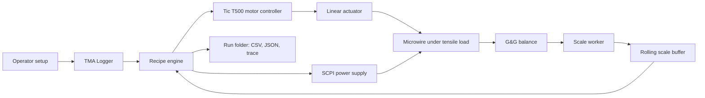
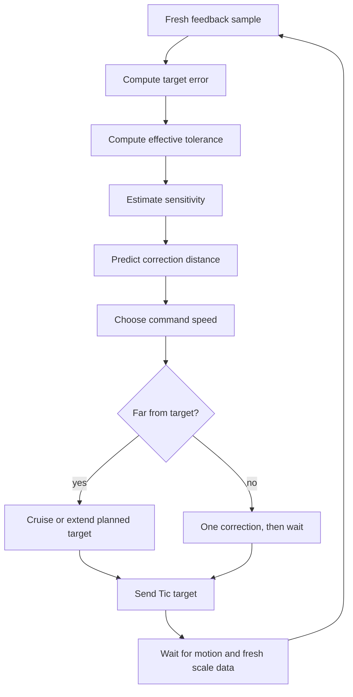
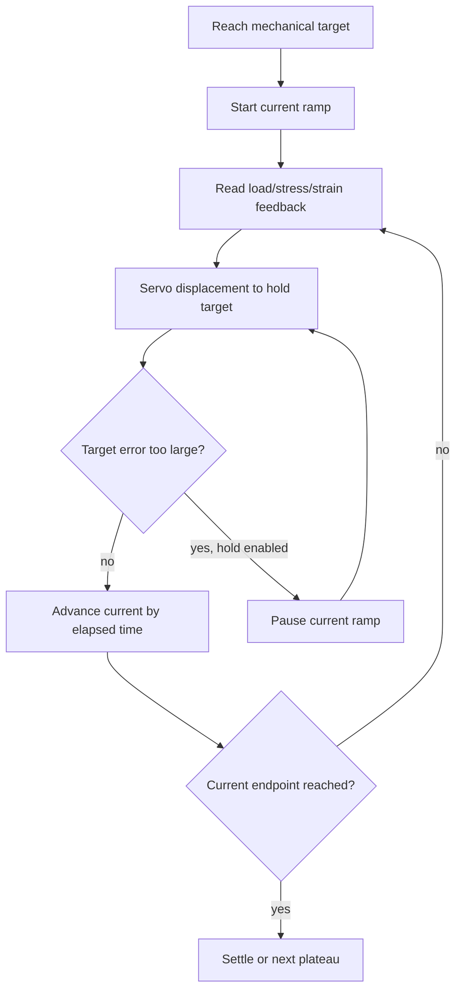

# TMA Presentation Context

Prepared for a presentation on Wednesday, 2026-05-13.

This document is a presentation-prep source, not a replacement for the operator docs. It collects the system context, the current implementation model, and a suggested story arc for explaining TMA clearly to people who have not followed the whole development process.

Primary source files:

- `data_logging/mini_dma_logger/mini_dma_logger.py`
- `docs/mini_dma_logger.md`
- `docs/mini_dma_speed_control.md`
- `docs/mini_dma_hardware.md`
- `docs/mini_dma_measurement_plan.md`

## Suggested Presentation Flow

### 1. Why We Built It

Core message:

TMA is a compact, experiment-specific system for measuring shape-memory microwires while controlling tensile load, stress, strain, and electrical heating in one synchronized workflow.

Good slide points:

- Microwires are small enough that a few grams of load correspond to large stresses.
- Shape-memory behavior changes during heating, so the rig must adjust mechanical displacement while current changes.
- A normal manual stress-strain setup is not enough for iso-stress or iso-load current sweeps.
- The system is closer to a quasi-static, feedback-controlled micro-DMA workflow than a high-bandwidth commercial DMA.

### 2. Hardware Stack

The current rig has three active subsystems:

- Motion: Pololu Tic T500 stepper controller driving a StepperOnline NEMA 8 captive linear actuator.
- Load feedback: G&G E150Y-C / E150Y-3 balance over RS232 serial.
- Heating: SCPI power supply path, modeled after the existing current annealing logger.

Important physical details:

- Balance range is 150 g with 0.005 g readability.
- The balance is used in request-response mode, not passive streaming.
- The measured request-response cadence is about 4.94 Hz, or about one useful load sample every 200 ms.
- The actuator has 2 mm lead travel per motor revolution and about 100 full steps/mm.
- With the Tic at 1/8 microstepping, the app uses about 800 Tic position units/mm.
- The motor is open loop. There is no independent stage-position encoder, so backlash, compliance, and slip must be inferred from force response and calibration.

Presentation framing:

The system intentionally trades high bandwidth for high-resolution force feedback and detailed logging. The balance is excellent for grams, but it is not a fast load cell.

### 3. What TMA Measures

The main logged quantities are:

- raw motor position in mm
- specimen tensile displacement in mm
- applied tensile load in g
- strain in percent
- stress in MPa
- current setpoint and measured current
- voltage, resistance, and power
- recipe phase, target, plateau index, and automation metadata

The stress conversion assumes a round wire:

```text
stress_mpa_per_g = 39226.6 / (pi * d_um^2)
target_load_g = target_stress_mpa / stress_mpa_per_g
```

Why this matters:

- For a 13 um wire, 1 g is about 73.9 MPa.
- A 0.005 g balance digit is already about 0.37 MPa for a 13 um wire.
- A 0.1 g load error is about 7.4 MPa for a 13 um wire.

This makes the force-control problem very sensitive even though the visible load values look small.

### 4. Software Architecture

The main implementation is a PyQt6 application in `mini_dma_logger.py`. It combines:

- UI controls for recipe setup, sample metadata, hardware settings, and live plots.
- A scale worker thread that repeatedly requests balance readings.
- A Tic command dispatcher that sends motor targets, halt, zero, and keepalive commands.
- A power-supply control path for current annealing and continuity checks.
- A recipe engine built from `AutomationStep` objects.
- A logging layer that writes raw data, summarized recipe rows, setup rows, metadata, and control decisions.

The important architectural split is clocks:

- Control interval: fast recipe decision timer, default 50 ms.
- Scale acquisition interval: balance request interval, default 250 ms.
- Log interval: main CSV row interval, default 500 ms.
- UI refresh interval: display/plot update interval, default 200 ms.
- Tic keepalive/status and supply readback each have separate timing.

Presentation framing:

The app can think faster than the balance can answer, but it only makes closed-loop load/stress decisions from fresh balance data.

### 5. Session Files And Audit Trail

Each run is saved into its own folder. The important files are:

- `measurement.csv`: the main recipe/session log.
- `measurement.txt`: tabular text companion with headers.
- `metadata.json`: settings, sample identity, hardware timing, recipe parameters, calibration report, and run state.
- `scale_raw.csv`: every acquired balance reply with raw and applied load.
- `control_trace.csv`: every closed-loop decision, wait, correction, acceptance, backlash decision, and command speed.
- `setup.csv`: enabled length setup/preload data separated from the main recipe.
- `setup.txt`: setup text companion.

How to explain it:

`measurement.csv` is the clean experiment table. `scale_raw.csv` is the fast force evidence. `control_trace.csv` is the "why did the controller do that?" file.

### 6. Normal Measurement Workflow

Recipes normally start with length setup before the main recipe log begins:

1. Operator enters the measured mounted wire length.
2. TMA ramps to the configured setup preload stress if the wire is below it.
3. If the wire is already above setup preload, TMA skips the preload ramp.
4. TMA returns toward 0 g applied load.
5. The app computes unloaded gauge length `l0`.
6. The main recipe starts with strain zero and stress conversion tied to that setup.

Why this exists:

- Microwires can start slack, bent, or not perfectly aligned.
- Strain zero should not be the arbitrary initial motor position.
- The elastic unload path can estimate where the taut zero-stress length is.
- Setup data is saved separately so it can be inspected without contaminating the main measurement CSV.

Important detail:

Setup preload uses the requested setup time as a current-to-target time once the wire is engaged. For example, if the preload target is 20 MPa and the wire starts at 12 MPa, the 10 s setup rule means moving from 12 MPa to 20 MPa over about 10 s, not blindly using a from-zero slope.

### 7. Recipe Types

Current implemented recipe families:

- Displacement ramp: open-loop displacement movement from the recipe origin.
- Cyclic displacement: repeated open-loop displacement cycles.
- Displacement hold: move to an offset and hold for time.
- Hsw plateau scan: seek load/stress/strain plateaus and record points.
- Calibration: automatic preload plus forward/reverse micro-move characterization.
- Iso-load current sweep: hold load while current ramps.
- Iso-stress current sweep: hold stress while current ramps.
- Iso-strain current sweep: hold strain while current ramps.

The presentation should probably focus on calibration and iso-stress current sweep, because those explain why the system is more than a motorized logger.

### 8. How Load And Stress Control Works

For load/stress/strain targets, TMA uses closed-loop seeking:

1. Read the latest valid feedback value.
2. Compute target error.
3. Raise the requested tolerance to what the rig can physically resolve.
4. Estimate sensitivity, such as g/mm or MPa/mm.
5. Predict a correction distance.
6. Choose a motor speed.
7. Decide whether it is safe to cruise or whether it must use gated one-move-at-a-time feedback.
8. Send a Tic target position.
9. Wait for fresh feedback before making another force-control decision.

Core formulas:

```text
predicted_move_mm = correction_gain * abs(error) / abs(sensitivity)

effective_tolerance =
    max(requested_tolerance, motor_step_floor, measured_noise_floor)
```

The controller has two broad behavior modes:

- Far mode: when safely far from target, it may keep moving and update the predicted target on each new scale sample.
- Near/gated mode: near target, after crossing the target, during setup preload, or when feedback looks suspicious, it sends one correction and waits for post-move scale feedback.

This is one of the most important presentation points:

The app does not simply "move at x mm/s". For closed-loop load/stress control, the target quantity is load, stress, or strain, and motor displacement is the actuator output.

### 9. Speed Control In Plain Language

There are several speeds:

- Motor speed in mm/s: what the Tic receives as a motion limit.
- Target ramp rate in g/s, MPa/s, or %/s: how quickly the desired target changes.
- Current ramp rate in mA/s: how quickly heating current changes.
- Correction speed: how fast the stage moves during feedback correction.
- Achieved average correction speed: motor move time plus dead time waiting for settling and scale response.

Near target, TMA may command a higher instantaneous motor speed than the desired average speed. This compensates for dead time:

```text
near_target_period =
    motor_move_duration
  + settle_margin
  + next_scale_reply
```

If the move itself is 0.2 s but the scale/dead-time overhead is another 0.3 s, the average correction cycle is slower than the motor command speed. The app accounts for that in gated feedback.

### 10. Current Sweeps

Current sweeps are the key shape-memory experiment mode.

The recipe first ramps to each mechanical target. Then it ramps current while trying to keep the chosen basis constant:

- Iso-load: keep applied load constant.
- Iso-stress: keep stress constant, using diameter to convert stress to load.
- Iso-strain: keep strain constant.

For load/stress current sweeps:

- The current ramp advances from elapsed time.
- The mechanical servo continues correcting displacement during the current ramp.
- Live stiffness learning is frozen during the main current phase, so thermal/phase-transition load changes are not mistaken for a new mechanical stiffness.
- Corrections are capped by strain percentage, stress-equivalent correction size, and hard stage speed.
- The control trace records whether each decision waited, accepted target, sent a correction, or skipped a reversal.

Optional current-ramp hold:

- The app can pause only the current ramp when filtered load/stress error gets too large.
- While current is held, the displacement servo keeps working to recover the target.
- Once the filtered error is inside the resume band for the required stable time, the current ramp resumes.
- The ramp clock is shifted by the hold duration so current does not jump forward as if time had kept advancing.

This distinction is worth a slide:

Pausing the current ramp is not the same as pausing the experiment. Mechanical control continues.

### 11. Calibration

There are two different calibrations:

1. Motor step calibration
2. Load/stiffness/backlash calibration

Motor step calibration:

- Uses external gauge readings and raw Tic position increments.
- Measures Tic units/mm directly.
- Current working value is about 800 Tic units/mm at 1/8 step, corresponding to 100 full steps/mm.
- The workflow is save-first/review-first, so results can be inspected before applying them.

Load/stiffness/backlash calibration:

- Runs length setup when enabled.
- Records baseline load noise.
- Seeks configured preload loads.
- Performs forward and reverse micro-move sweeps.
- Fits load stiffness in g/mm.
- Estimates backlash from the difference between forward and reverse load-position fits.
- Stores the report in `metadata.json`.
- Uses valid stiffness and load-noise estimates as priors for later control.

Important caveat:

Calibration is only as good as the mechanical state. A stable copper wire is good for rig characterization, while a transforming microwire is more realistic but can mix material behavior into the stiffness estimate.

### 12. Safety Model

Safety paths in the current system include:

- Always-visible emergency stop.
- Recipe stop/pause controls.
- Tic safe-start/energize/keepalive handling.
- Motor VIN preflight when motor supply control is configured.
- Soft position limits.
- Maximum applied-load limit.
- Raw scale display ceiling, default 30 g, to protect the 150 g balance.
- Setup preload overload guard.
- Continuity current for wire-break detection.
- Voltage-limit behavior during current sweeps.
- Power-supply output off on stop/fault.
- Recovery prompts for displacement or load return after stop/fault.

Raw scale ceiling vs applied load limit:

- Applied load is the wire load computed from the zero-load reference.
- Raw scale display is the actual balance display.
- The raw display ceiling is a hard balance-protection interlock. It blocks tension-increasing motion while allowing relaxing motion when appropriate.

Voltage limit behavior:

- If a current sweep reaches the voltage limit before reaching the requested current, TMA ramps recipe current back to that sweep's start current and advances instead of blindly continuing.
- If current collapses near zero at a meaningful setpoint while voltage is near the limit, the app treats this as an open-circuit/wire-break condition and stops safely.

### 13. What The System Is Good At

Strong claims that are fair:

- It unifies motion, load feedback, and current annealing into one reproducible session.
- It saves enough evidence to reconstruct controller decisions after a run.
- It is designed around the real limitations of the bench balance.
- It supports iso-load, iso-stress, and iso-strain current sweeps, not only open-loop motion.
- It computes strain from a physical preload/return setup rather than from an arbitrary initial position.
- It has calibration workflows for both motor displacement and mechanical load response.

Claims to avoid overstating:

- It is not a high-bandwidth commercial DMA.
- The motor is open loop.
- The balance is not a fast force sensor.
- Backlash and stiffness remain empirical and sample-dependent.
- Final control tuning still depends on live rig validation.

### 14. Known Risks And Open Questions

Current limitations to mention honestly:

- Balance bandwidth is the main feedback bottleneck.
- Phase transitions during current sweeps can look like bad stiffness if the controller is allowed to learn stiffness at the wrong time; the current implementation freezes live stiffness during the main current-sweep phase to reduce this risk.
- Backlash and stiction can make reversals expensive or misleading.
- A bad stiffness prior can produce too-large or too-small correction distances.
- The system needs run-by-run artifact review, especially after unusual behavior.
- The exact best calibration procedure may still be refined with more real data.

Recent debugging lessons:

- `scale_raw.csv` is the cadence source. Do not infer feedback timing from sparse `measurement.csv` or `setup.csv` alone.
- The mirrored run log and `control_trace.csv` are the best way to explain why the controller waited, slowed, reversed, accepted, or held current.
- Completion of a run does not prove good control. Inspect setup, target ramp, current sweep, and recovery separately.

## Possible Slide Outline

1. Title: TMA for Shape-Memory Microwires
2. Measurement Problem: tiny wires, grams-to-MPa sensitivity, heating changes mechanics
3. Hardware Overview: balance, linear actuator, Tic controller, power supply
4. Software Overview: one PyQt app, recipe engine, hardware workers, logging
5. Data Flow Diagram: scale + motor + supply into session files and live control
6. Mandatory Length Setup: measured mounted length, optional preload, return-to-zero, computed `l0`
7. Recipe Types: displacement, Hsw scan, calibration, iso-load/stress/strain sweeps
8. Closed-Loop Control: target error, stiffness, tolerance, correction distance
9. Current Sweep Behavior: current ramp plus mechanical servo
10. Current-Ramp Hold: current pauses, displacement keeps correcting
11. Calibration: motor units/mm, stiffness, backlash, noise
12. Safety: emergency stop, load limits, raw scale ceiling, voltage/wire-break handling
13. Example Run Artifacts: `measurement.csv`, `scale_raw.csv`, `control_trace.csv`, `metadata.json`
14. What It Can And Cannot Claim: quasi-static control, not high-bandwidth DMA
15. Next Steps: validation runs, tuning, better force sensor if bandwidth becomes limiting

## Simple System Diagram



## Control Loop Diagram



## Current Sweep Diagram



## One-Sentence Summary

TMA is a calibrated, audit-friendly, quasi-static microwire measurement rig that uses a stepper stage to servo load, stress, or strain while electrical current is ramped, with the control strategy explicitly shaped around the real 5 Hz balance feedback limit.

