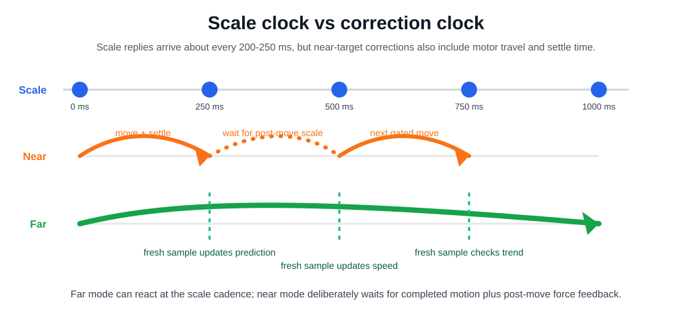
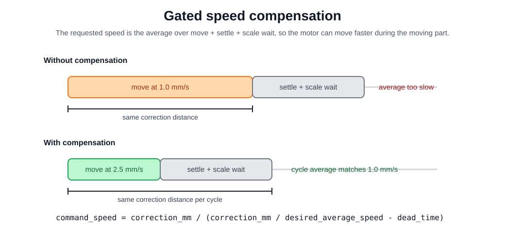
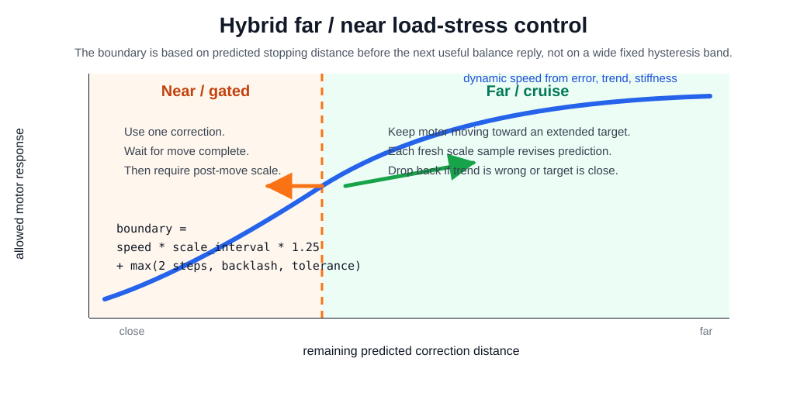
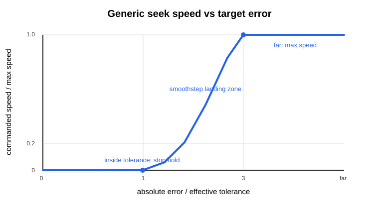
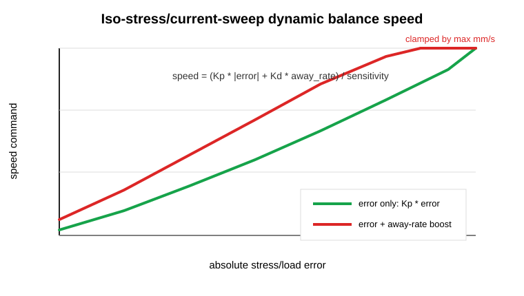

# Mini DMA Speed Control

This document describes how Mini DMA chooses motor speed and correction distance during displacement ramps, load/stress/strain target seeking, setup preload, and iso-load/iso-stress/iso-strain current sweeps.

It is meant to be the operator-facing source of truth for the control logic. If code behavior changes, update this file in the same change.

## Hardware Limits

The Mini DMA rig has two different clocks:

- **Motor command clock:** Tic commands can be sent quickly, especially through the persistent native-USB/dispatcher path.
- **Force-feedback clock:** the current G&G balance replies to request/response reads at about 4-5 Hz, so fresh load/stress feedback is roughly every 200-250 ms.

This does not mean every closed-loop correction happens at 4-5 Hz. In conservative near-target mode, the controller sends one move, waits until that move should be physically complete, adds a small settle margin, and then waits for a fresh post-move balance sample. The real near-target correction frequency is therefore often closer to 1-2 Hz:

```text
near_target_period =
    motor_move_duration
  + settle_margin
  + next_scale_reply
```

Far from target, Mini DMA can now use the scale clock more aggressively. The motor may keep moving toward an extended predicted target, and each new balance sample is used as a delayed reality check. The controller can update speed, extend the target, or drop back to conservative mode as soon as that fresh scale sample arrives. It still must not stack multiple force corrections from one unchanged scale value.



## Quantities

Mini DMA keeps several related speed and sensitivity terms:

| Term | Meaning |
| --- | --- |
| `speed_mm_s` | Motor/stage speed command in mm/s. |
| `target_rate` | Requested recipe ramp rate in g/s, MPa/s, or %/s. |
| `basis` | Controlled quantity: load `g`, stress `MPa`, strain `%`, or position `mm`. |
| `error` | `target_value - measured_value` in the selected basis. |
| `effective_tolerance` | Requested tolerance raised to what the rig can physically resolve. |
| `sensitivity` | Current estimate of how strongly the sample responds to motion, e.g. g/mm, MPa/mm, or %/mm. |
| `decision_interval` | Expected time between useful load/stress feedback samples, usually the scale request interval. |
| `desired_average_speed` | Average motor speed the controller wants to achieve over a full correction cycle. |
| `command_speed` | Instantaneous motor speed sent to the Tic for the moving part of that cycle. |
| `correction_mm` | Specimen displacement correction requested by one closed-loop decision, excluding backlash take-up. |
| `max_speed` | User-facing hard motor speed cap for the active mode. |

Mini DMA stores the motor conversion as two values: mechanical full motor steps/mm and the Tic step mode. The derived value used for position commands is Tic controller position units/mm. The current rig is mechanically about `100 full motor steps/mm`; with the Tic configured for `1/8 step`, the controller coordinate is:

```text
Tic units/mm = full_motor_steps/mm * microsteps/full_step
             = 100 * 8
             = 800 Tic units/mm
```

The external-gauge motor step calibration confirmed this value (`798.4 Tic units/mm`, `R2 = 0.99998`), so Mini DMA should use about `100 full steps/mm` and `800 Tic units/mm` at 1/8 step. Older runs and profiles that used `100 steps/mm` treated full motor steps as if they were Tic position units and therefore report motor displacement and strain eight times too large for the same real Tic travel.

If the Tic step mode is changed, Mini DMA derives the new controller conversion from the full-steps/mm setting:

| Tic step mode | Mini DMA value for this rig |
| --- | ---: |
| Full step | `100 Tic units/mm` |
| 1/2 step | `200 Tic units/mm` |
| 1/4 step | `400 Tic units/mm` |
| 1/8 step | `800 Tic units/mm` |

There is usually no reason to reduce microstepping for the current Mini DMA speeds. At `1/8 step`, `1 mm/s` is `800 Tic units/s`, which Mini DMA sends to the Tic as a max-speed value of `8,000,000` because Tic speed units are `Tic units/s * 10000`. The inspected controller's permanent reset default was `10,000,000`, equivalent to `1.25 mm/s` at `800 Tic units/mm`, and Mini DMA can still request per-move temporary speed limits from the configured `mm/s` controls. Only consider a coarser step mode if the controller rejects the requested pulse rate or the motor loses steps at the needed speed; then recalibrate and update this conversion.

For example, `5 mm/s` at 1/8 step is `4000 Tic units/s`, sent as a Tic max-speed value of `40,000,000`. Switching to 1/4 step would halve the required pulse rate, but it also halves displacement resolution. When Mini DMA applies a different Tic step mode, it halts the motor, changes the controller mode, recomputes `Tic units/mm`, and rewrites the Tic current-position register so the physical mm coordinate remains continuous.

The saved backlash compensation is intentionally disabled during the `Calibration` recipe. Calibration uses its forward/reverse micro-move data to estimate backlash, so the previous value must not inflate the target acceptance band or add reversal take-up while the new value is being measured.

## Position Ramps

Displacement-only recipes are open-loop position motion. The target position is known from the recipe, so Mini DMA schedules motion by distance and the configured displacement speed:

```text
move_duration_s = Tic trapezoid/triangle profile duration
```

When live Tic status includes max acceleration and max deceleration, Mini DMA converts those Tic units into `mm/s^2` and estimates the same style of motion profile the Tic uses for target-position moves: accelerate toward the requested speed, optionally cruise, then decelerate to the target step. If acceleration/deceleration are unavailable, it falls back to the older linear `distance / speed` estimate. This does not change how motion is commanded: Mini DMA still sends target positions plus maximum speed, and the Tic still owns the physical ramp.

The acceleration-aware estimate is used for recipe duration estimates, post-move feedback gates, and the predicted travel available before the next useful scale sample. The motor may receive planned position updates between force samples because displacement ramps do not need fresh scale feedback to know where the target is.

## Load / Stress / Strain Seeking

Load, stress, and strain seeking are closed-loop. A correction decision is:

1. Read the latest fresh feedback value.
2. Compute error in the controlled basis.
3. Compute an effective tolerance.
4. Estimate or reuse sensitivity.
5. Predict a correction distance.
6. Choose a speed.
7. Decide whether the controller is safely far from target or near/suspicious.
8. Apply backlash/reversal rules.
9. Send or extend one motor move.

The final mode decision is important:

- **Far mode:** if the remaining predicted correction distance is safely larger than the distance the motor can travel before the next useful balance sample, Mini DMA may extend the motor target without waiting for the previous move to finish. It still waits for a new scale sample before making the next force-control decision.
- **Near/setup mode:** if the target is close, the trend disagrees with prediction, the target was crossed, the scale data is stale, or the mandatory setup preload is running, Mini DMA sends one correction and then waits for expected move completion plus fresh post-move scale feedback before deciding again. Setup preload also has an overload guard: if the live load/stress greatly exceeds the requested setup target, the run stops instead of issuing another tensioning correction.

In near mode, the speed shown by the recipe or dynamic controller is treated as the desired average speed over the full correction cycle, not only the speed while the motor is physically moving. Mini DMA can therefore command a higher instantaneous motor speed to compensate for dead time:

```text
dead_time_s =
    settle_margin_s + decision_interval_s

desired_cycle_s =
    correction_move_mm / desired_average_speed_mm_s

moving_time_s =
    desired_cycle_s - dead_time_s

command_speed_mm_s =
    correction_move_mm / moving_time_s
```

Then:

```text
command_speed_mm_s =
    clamp(command_speed_mm_s, minimum_speed, hard_speed_cap)
```

If `moving_time_s <= 0`, the requested average speed is impossible for that tiny correction and feedback dead time, so Mini DMA uses the hard speed cap. The move will still be slower than the requested average, but that is a physical timing limit rather than a calculation delay.

Example:

```text
desired average speed = 1.0 mm/s
correction distance = 0.5 mm
dead time = 0.30 s

desired cycle time = 0.5 s
moving time = 0.5 - 0.30 = 0.20 s
command speed = 0.5 / 0.20 = 2.5 mm/s
```

Without this compensation the same correction would move for `0.5 s`, then wait about `0.30 s`, giving only about `0.63 mm/s` average.



## Effective Tolerance

Load/stress target tolerance is automatic. Mini DMA starts from a small requested load floor of `0.005 g`, converts it to stress when the active basis is MPa, and then raises that request when the hardware cannot physically resolve something tighter.

```text
requested_load_floor = 0.005 g
step_floor = abs(sensitivity) * motor_step_mm
noise_floor = calibrated_load_noise_g * 3  (converted to MPa when needed)
effective_tolerance = max(requested_load_floor_in_current_basis, step_floor, noise_floor)
```

For example, if one motor step changes stress by 2 MPa, a 0.25 MPa tolerance is not physically meaningful, and neither is the 0.005 g starting floor. The controller must treat a roughly step-sized band as the realistic target region. This is why the operator should not need to retune tolerance for every wire length; the calibrated/live stiffness and motor step size set the real floor.

## Stiffness And Sensitivity

The calibration recipe stores load stiffness in g/mm:

```text
calibrated_stiffness_g_per_mm
calibrated_length_mm
```

For a different mounted wire length, Mini DMA rescales it:

```text
current_stiffness_g_per_mm =
    calibrated_stiffness_g_per_mm * calibrated_length_mm / current_l0_mm
```

Stress sensitivity is calculated from load stiffness and wire diameter:

```text
sensitivity_MPa_per_mm =
    stress_mpa_from_load_g(current_stiffness_g_per_mm, diameter_mm)
```

Strain sensitivity is geometric:

```text
sensitivity_pct_per_mm = 100 / l0_mm
```

During setup, calibration, and ordinary load/stress seeking, Mini DMA can also update live stiffness from recent observed response:

```text
observed_sensitivity = abs(delta_value / delta_effective_displacement_mm)
live_stiffness = (1 - alpha) * old_live_stiffness + alpha * observed_stiffness
```

Only moves large enough to be meaningful are used. Tiny moves below about half a motor step are ignored.

The live stiffness is kept both for the exact target currently being chased and as a run-level stiffness estimate. That matters during setup and non-current ramps, where the desired target changes every tick. During iso-load/iso-stress/iso-strain current sweeps, live stiffness learning is frozen and Mini DMA uses the latest setup/calibration stiffness prior instead of treating current-driven load/stress fluctuations as mechanical stiffness.

## Predictive Correction Distance

When sensitivity is available, Mini DMA estimates the correction distance:

```text
predicted_move_mm = correction_gain * abs(error) / abs(sensitivity)
```

Then it clamps the move:

```text
max_move_mm = l0_mm * max_correction_strain_pct / 100
correction_move_mm = clamp(predicted_move_mm, motor_step_mm, max_move_mm)
```

For current-sweep servo holds, this clamp is strain-based instead of clock-based. The default `5 %` cap means a `30.56 mm` wire can receive at most about `1.53 mm` of predicted correction in one feedback decision, while a longer wire receives a proportionally larger absolute travel. Motor speed still controls how long that move takes, but it no longer artificially limits the correction distance to `speed * scale_interval`.

## Far-Vs-Near Mode Switching

Mini DMA does not use a broad fixed hysteresis band for the far/near transition. The boundary is predictive and speed-dependent:

```text
remaining_correction_mm =
    abs(error) / abs(sensitivity)

tolerance_mm =
    effective_tolerance / abs(sensitivity)

feedback_travel_mm =
    speed_mm_s * decision_interval_s * 1.25

safety_margin_mm =
    max(2 * motor_step_mm, backlash_mm, tolerance_mm)

far_mode_allowed =
    remaining_correction_mm
      > feedback_travel_mm + safety_margin_mm + tolerance_mm
```

That means a high speed automatically switches to near mode earlier, because the motor can travel farther before the next reliable balance reply. A low speed can stay in far mode closer to the target. This keeps responsiveness high without using a lazy fixed hysteresis band.

Far mode is disabled immediately if:

- the scale sample has already been used for the current seek clock;
- the target was crossed;
- the new error is larger than the previous error by more than the tolerance margin;
- the sensitivity estimate is missing or invalid;
- the step is a zero-load return or recovery move.



## Generic Smooth Landing

For non-current-sweep seeking without sensitivity-specific behavior, Mini DMA uses a smooth landing zone. Far from target it can use full speed; near target it slows down to the minimum useful motor speed.



The generic shape is:

```text
error_ratio = abs(error) / effective_tolerance

if error_ratio >= full_speed_error_ratio:
    speed = max_speed
else:
    scaled = clamp((error_ratio - 1) / (full_speed_error_ratio - 1), 0, 1)
    smooth = smoothstep(scaled)
    speed = max_speed * smooth
```

Inside tolerance, the target is reached and no correction is sent.

## Current-Sweep Servo Hold

During iso-load, iso-stress, and iso-strain current sweeps, the motor must keep balancing while current changes the sample. This is not a fixed correction-step controller anymore. The main visible settings are:

```text
Stage speed cap = absolute max motor speed
Correction strain cap = maximum specimen strain change per predictive move
Correction strain-rate cap = maximum correction speed in %/s
```

Less frequently changed caps, hold bands, and filter settings are available behind the current-sweep advanced-control expander. They stay visible on demand, but the normal recipe page does not show every tuning rail by default.

The correction distance is predictive, but capped by both strain and planned stress change instead of by the scale feedback interval. With the default `5%` strain cap, a `30.56 mm` wire can receive up to about `1.53 mm` of predicted correction in one move. A `10 mm` wire would cap the same correction at `0.50 mm`, so the aggressiveness scales with specimen length instead of absolute stage travel. The additional stress cap defaults to `10 MPa` per correction for stress/load current-sweep control, so a long or soft-looking wire cannot turn one bad stiffness estimate into a very large target jump.

The far/near mode switch applies here too:

- while far from the requested load/stress target, the servo can keep the motor moving continuously and revise the predicted target whenever a fresh scale sample arrives;
- near the target, or when the sample response stops matching the prediction, it switches back to one-move-at-a-time gated landing;
- the same dynamic speed calculation is used in both modes.

The actual speed below the configured ceilings is dynamic:

```text
speed_cap_from_strain_rate_mm_s =
    l0_mm * correction_strain_rate_pct_s / 100

speed_ceiling_mm_s =
    min(stage_speed_cap_mm_s, speed_cap_from_strain_rate_mm_s)

away_rate = max(0, -sign(error) * measured_value_rate)

requested_value_rate =
    K_error * abs(error)
  + K_away * away_rate

speed_mm_s =
    requested_value_rate / abs(sensitivity)

speed_mm_s = clamp(speed_mm_s, minimum_speed, speed_ceiling_mm_s)
```

In this block, `speed_mm_s` is the desired average servo speed. In far/cruise mode it is also approximately the motor command speed, because the motor can keep moving continuously between scale samples. In near/gated mode, Mini DMA converts it to a higher instantaneous command speed with the dead-time compensation above, then clamps that command to the same `speed_ceiling_mm_s`.

This means:

- larger error increases speed;
- if load/stress is moving away from the target, speed gets an extra boost;
- stiffer samples move slower for the same stress error because a small displacement changes stress a lot;
- more compliant or longer samples can move faster without overshooting as much;
- the `%/s` ceiling makes correction speed scale with gauge length;
- the user still has one hard safety ceiling in mm/s for the motor;
- gated wait time is compensated by faster moving-part speed when the hard caps allow it;
- the same smooth landing cap applies near target, so a high ceiling such as 5 mm/s is not used right outside the hold band.

By default the current ramp itself stays static, because transition temperature and thermal history can depend on the commanded current-ramp rate. When the optional current-ramp hold is enabled, Mini DMA holds the present current setpoint when a short filtered load/stress signal shows a persistent absolute target error. The same rule is used while current is rising and falling: if stress/load runs too far above or below the target, the current ramp pauses while displacement catches up. The pause/resume bands are expanded by recent balance noise and by a small MPa-equivalent floor, so ordinary annealing fluctuations do not trigger a hold by themselves. While held, the displacement servo keeps correcting, and the current ramp resumes after the filtered signal returns inside the resume band. The ramp clock is shifted by the hold duration, so resuming does not jump to the current that wall-clock time would otherwise imply. There is no maximum hold-time stop; wire-break/current faults are handled by their own protection paths. If the sample response is consistently too fast for the servo to track, lowering the fixed current ramp rate is still the cleaner first adjustment.

The current sweep always returns current to the start current at each target, so each target records a heating and cooling leg. The `First overheating` option changes only the recipe sequence: the first target's current sweep is repeated once before Mini DMA advances to later target loads/stresses/strains. This is intended for wires whose very first heating has a higher transformation temperature than later heating/cooling cycles. With `First overheating` enabled, the first target runs up/down/up/down; later targets run the normal up/down pair.

The dashboard header displays the most recent commanded speed in fixed-width cells:

```text
mm/s, g/s, MPa/s, %/s
```

The g/s and MPa/s values use the frozen setup/calibration stiffness prior during current-sweep control. Mini DMA does not update this stiffness from current-driven load/stress fluctuations, so phase/current transients cannot inflate backlash cost or rewrite the mechanical sensitivity while the sweep is in progress. The %/s value uses the current `l0`.



## Recipe Ramp Rates In g/s, MPa/s, And %/s

When a recipe says `1 MPa/s` or `0.1 g/s`, that is a target-value ramp rate, not directly a motor speed.

Mini DMA converts it through sensitivity:

```text
speed_cap_from_ramp = target_rate_value_per_s / abs(sensitivity_value_per_mm)
```

Examples:

- `1 MPa/s` with `20 MPa/mm` sensitivity becomes `0.05 mm/s`.
- `0.1 g/s` with `2 g/mm` sensitivity becomes `0.05 mm/s`.
- `1 %/s` with `3.33 %/mm` sensitivity becomes `0.30 mm/s`.

The final motor speed is the smaller of the recipe/global max mm/s and any active target-ramp speed cap, except during setup slack take-up where the sample has not started responding yet.

For current-sweep load/stress target ramps, this ramp-rate cap is only applied near the target. If the controller is far from target, it is allowed to catch up under the dynamic balance speed ceiling instead of crawling at the recipe ramp rate while the current ramp keeps changing the sample.

## Setup Preload

Setup preload is special because the wire may initially be slack or bent.

The setup sequence is:

1. Ask for approximate starting length.
2. Use that length to rescale the stiffness prior.
3. Move toward the setup preload target.
4. Once the wire responds, convert the requested setup time into an `MPa/s` target ramp through stiffness.
5. Ask for measured length at preload.
6. Return toward zero load over the setup return-time target and compute `l0`.

Before force starts responding, Mini DMA uses the setup slack take-up speed in `%/s`; with `20 mm` length and `1 %/s`, that is `0.2 mm/s`. Tiny residual loads near zero are still treated as slack take-up, because a long or bent wire can show a few milligrams of apparent load before it is meaningfully straight. Each slack take-up move is also capped by the `5 MPa` stiffness-prior equivalent, so a plausible prior prevents large pre-contact jumps. Once applied load rises above the slack-take-up threshold, setup leaves slack mode for that preload target and uses the same target-space step shrinking as current-sweep load/stress control: coarse while far away, `1 MPa` equivalent near target, and one motor step in the fine band. The first slack-to-taut load jump is treated only as engagement evidence, not as elastic stiffness evidence; live stiffness learning starts from later post-contact samples, and setup preload acceptance is capped so a single large jump cannot make a multi-MPa overshoot look "close enough." The setup time is interpreted as current engaged load/stress to preload target, not always `0 -> preload`; for example, starting at `82 MPa` with a `20 MPa` target and `10 s` setup time gives about `6.2 MPa/s`. That same setup-time ramp cap applies while increasing preload and while relaxing an overshoot from above target. Setup preload deliberately stays in one-move-at-a-time feedback and does not use cruise feedback or dead-time speed compensation. Setup return-to-zero estimates the unload travel from the initial live load and stiffness, divides by the Manual Actions `Return-to-zero time`, and holds that planned unload speed instead of shrinking it on every near-zero sample; the actual return can still be slower when feedback gating and zero-plateau checks add time. The same return-time setting is used for manual displacement recovery and post-recipe return-to-start moves. If stiffness is still unknown near target, the fallback correction also uses the smooth landing curve; near target it sends one motor step at the minimum motor speed instead of a full global-speed-sized correction.

Current-sweep target ramps start in conservative gated feedback for load/stress control. Mini DMA sends one correction, waits for fresh post-move scale feedback, and only then decides the next correction. It does not update stiffness during the current sweep. Direction reversals in current-sweep load/stress control do not prepend the configured backlash distance; the controller sends the requested correction step, then uses the following scale response to decide whether the move was specimen motion or mostly backlash. This keeps a `1 MPa` or one-motor-step correction from being dominated by a saved `0.02 mm` backlash value.

For iso-load and iso-stress current sweeps, "dynamic speed control" means dynamic average correction speed. The most important controlled quantity is the step size, not the motor's instantaneous Tic speed. Mini DMA first predicts the mechanical correction from the frozen setup/calibration stiffness, then caps that correction by a smooth fraction of the current target-space error:

```text
if abs(error) <= near_step_band:
    planned_correction = one_motor_step
else:
    fraction = 20% -> 60%, increasing smoothly with error size
    planned_correction = min(abs(error) * fraction, active_hard_cap)
```

The active hard cap is the visible sweep hard cap while the current ramp is moving, and the hold hard cap while the current ramp is paused for target recovery. The hold hard cap defaults to `30 MPa`; older saved profiles that still contain the previous default `20 MPa` are migrated to `30 MPa`, while custom values are preserved. The hard cap remains an absolute safety rail; the smooth error fraction normally determines the requested correction. For load-control sweeps, the same MPa-equivalent values are converted to grams using the current wire diameter. The specimen correction is still clipped by the configured maximum correction strain percentage. This makes the controller progressively shrink real correction distance as it approaches target without abrupt far/mid/near bucket changes, so the average motion slows down even when the Tic command speed remains reasonably fast.

The Tic command speed is kept practical for these small corrections. During current-sweep balancing, Mini DMA will not deliberately creep below about `0.05 mm/s` unless the stage speed cap itself is lower. The balance feedback is normally the bottleneck, so a tiny correction should finish quickly and then wait for the next fresh scale reply instead of spending seconds moving slowly.

Current-sweep load/stress correction is conservative-gated in target-ramp, hold, and settle phases. Mini DMA does not use cruise feedback for these modes, because delayed balance samples can otherwise stack several stale corrections while the sample is already passing through the target. During the main current phase, a far-from-target force error can still cruise on a fresh in-flight scale sample when the safety margin says the remaining error is much larger than feedback latency, backlash, tolerance, and motor-step floors. Each gated force correction consumes one fresh scale sample; in the very-near/fine band the next correction waits for two fresh scale samples so one delayed or noisy value cannot immediately trigger a reversal.

Backlash is treated as its own state, but it is no longer trusted as guaranteed free travel during current-sweep force control. Current-sweep load/stress reversals send the dynamic correction step directly, even outside the finest band, because a saved backlash distance can be much larger than the intended stress correction. The raw/effective displacement split remains available for true backlash-only moves in other seek modes, but the current-sweep force servo favors observed scale response over predictive backlash injection.

Each closed-loop seek decision is written to `control_trace.csv` in the run folder. The trace includes target, live value, error, tolerance, stiffness/sensitivity, motor-step size, correction distance, backlash distance, command speed, required/observed post-move sample count, target motor position, effective specimen target, wait reason, and command result. Use this file when the behavior looks strange: it should explain whether Mini DMA waited for feedback, took up backlash, sent a correction, blocked a move, or accepted the target.

The live setup, recovery, and dashboard graphs are UI views, not the raw acquisition clock. They append a new plotted point on the UI refresh timer when a fresh scale reply is available, including during operator prompts, post-session displacement recovery, and the main recipe view between scheduled CSV rows. Main dashboard live plot points use the latest already-known motor/scale/supply state, so they do not send extra serial commands and are not written to the measurement CSV. The live plot history is capped so Matplotlib redraws stay bounded on slower PCs. For auditing true balance cadence, use `scale_raw.csv`, whose elapsed time remains continuous across setup and normal recipe logging.

The UI refresh interval does not set the control-loop or raw balance frequency. The default `200 ms` UI refresh only controls labels and live dialog/graph updates. The request/response scale cadence is set by the scale poll interval and the balance reply speed, the main recipe CSV cadence is set by the log interval, Tic status has its own slower polling path, and supply readbacks remain throttled separately so voltage/current queries do not block current setpoint commands. Seeing `measurement.csv` rows at `500 ms` therefore does not mean the scale or servo only updated every `500 ms`; inspect `scale_raw.csv` and `control_trace.csv` for that.

The setup points are saved to `setup.csv` and `setup.txt` in the run folder. If setup jumps or oscillates, inspect `setup.csv` first.

Two load limits are enforced differently because they protect different things. The applied-load limit is a directional specimen/load boundary: above it, Mini DMA blocks new tension-increasing moves and halts an in-flight tensioning move, but it does not stop the recipe just because feedback slightly overshot; relaxing moves remain available so the controller can return toward target. The raw scale display limit is a hard balance-protection interlock: when the live balance display reaches the limit, Mini DMA halts the motor, stops automation, and blocks ordinary moves until the displayed scale value is below the limit again.

During the post-preload return to zero, Mini DMA computes `l0` from the clean linear unload segment instead of blindly using the final slack position. It fits stress/load versus position while the wire is still taut, extrapolates that line to zero stress, and uses that intercept as the unloaded stage position. Once recent unload points are low-stress and their slope collapses relative to the fitted elastic line, Mini DMA treats that as slack onset: it commits the fitted zero-stress intercept, returns to that position, and stops driving farther into visibly slack wire. That committed slack-onset intercept is reused when applying `l0`; later low-slope points do not refit the baseline to a different zero position. The later near-zero/slack plateau is still useful confirmation and can update the run's corrected zero-load scale reference. If the motor keeps relaxing but the raw balance only fluctuates inside a small flat band, the controller uses the center of that raw band as the corrected zero-load reference for the current run and returns to the first plateau position before computing or confirming `l0`. The plateau must last at least `0.8 s` and span at least the larger of `0.05%` of the current `l0` or `4` motor units, so the fallback accepts a flat balance sooner while still respecting motor resolution. The same plateau fallback is used by final zero-load return and manual load-zero recovery.

Zero-load acceptance is stricter than ordinary target acceptance. The ordinary load/stress tolerance can be inflated by stiffness, motor step size, noise, and backlash so the controller does not hunt near a preload target. During return-to-zero, that inflated band is not allowed to silently accept a high residual load as `0 g`; only a truly near-zero residual or the stable near-zero plateau fallback can finish the return.

## Backlash And Reversal Rules

Backlash take-up is real motor travel that should not count as specimen displacement. Mini DMA therefore keeps:

- raw motor position;
- effective specimen displacement;
- backlash take-up travel excluded from strain.

Direction reversal is expensive near target. Mini DMA should not reverse just because one sample crossed the target by less than the physical reversal band.

The reversal band is based on:

```text
effective_tolerance
motor_step_mm * sensitivity
backlash_mm * sensitivity
```

If a correction crosses the target but the remaining error is inside this band, Mini DMA accepts the target as reached instead of reversing immediately. This prevents backlash-driven hunting.

## Current Limitations

The current controller is now hybrid feedback-based: far from target it can keep the motor moving between scale replies, and near target it returns to conservative post-move feedback gating. It compensates for large error and moving-away trends, but it still does not have full current feed-forward.

A possible future layer is current-ramp feed-forward:

```text
predicted_error =
    current_error
  + measured_value_rate * scale_latency_s
  + expected_current_effect
```

Then:

```text
requested_value_rate =
    Kp * predicted_error
  + Kd * away_rate
  + feedforward_from_current_ramp
```

This matters during current annealing because the wire can contract quickly as current rises. Feed-forward would let the motor start compensating before the delayed scale feedback shows the full stress increase. For now, Mini DMA keeps the requested current ramp static and uses the hybrid motor servo to follow it.

## What To Check In A Run

For debugging speed control:

1. Open the run folder.
2. Inspect `setup.csv` for pre-measurement preload behavior.
3. Inspect `measurement.csv` for recipe behavior.
4. Inspect `scale_raw.csv` for real balance sample timing and noise.
5. Inspect `control_trace.csv` for every closed-loop wait, correction, backlash take-up, acceptance, and blocked move.
6. Compare commanded displacement changes to load/stress changes.
7. Check whether oscillations start at direction reversals, after stiffness updates, or during current-induced transitions.

Important symptoms:

| Symptom | Likely meaning |
| --- | --- |
| Slow movement before any load change | Slack take-up or stiffness prior too conservative. |
| Huge overshoot after first load response | Sensitivity too low, correction distance too large, or scale lag. |
| Repeated target crossing around preload | Reversal/backlash band too small or speed too aggressive near target. |
| Long, infrequent current-sweep steps | Correction distance too large, command speed too low, or waiting for post-move scale feedback. Check `control_trace.csv`. |
| Stress rises during current ramp while displacement lags | Need higher max speed, stronger away-rate gain, or current feed-forward. |
| Load stops changing while motor keeps moving toward zero | Setup return should detect slack onset from the collapsed unload slope, commit the linear zero-stress intercept, and return there; near-zero plateau fallback is the later backup. |

## Operator Rule Of Thumb

Use one visible max speed as the safety ceiling. Let the controller choose the actual speed below that ceiling from error, stiffness, scale timing, and backlash.

For long, compliant wires, a higher max speed may be safe because the same motor step changes stress less. For short, stiff wires, the same mm/s can produce large MPa jumps.
